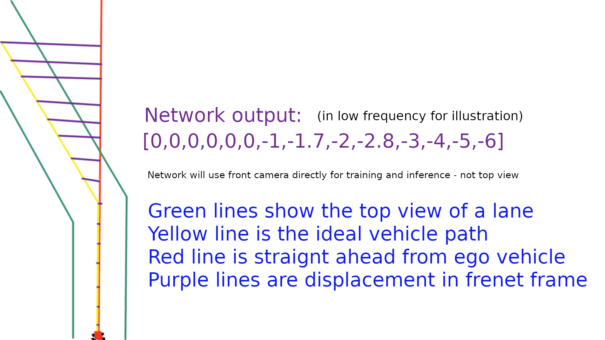

# Road attention 

This project aims to create a lane detection module using attention module from transformer architecture.

Our objective is to counter the computational constraints posed by existing methods and to devise a solution efficient enough to be trained using resources readily available to teams or individuals with low budget. This project has the potential to assist researchers and students alike, allowing them to work on similar projects without the requirement for extensive resources like GPU superclusters, which are often out of reach for many.

Tesla, along with other industry leaders, employs a modified ResNet-50 model for their perception module, as disclosed by Andrej Karpathy on Tesla Autonomy Day. These potent models demand considerable computational resources and massive dataset to train and test. Our goal is to challenge this necessity by adapting these architectures, yet calibrating them to be trained efficiently on a couple of GPUs.

Motivated by the success of the Stanford Alpaca team and their usage of LoRA, we plan to experiment with Facebook's LLaMA model, a pre-trained language model, to investigate if its knowledge can be transferred and applied to vision tasks. This interdisciplinary approach could provide valuable insights and expand the capabilities of machine learning models. In fact, a study from the Google Brain team suggests that transformers can perform well in some vision tasks: https://arxiv.org/pdf/2010.11929.pdf. If you have any alternative ideas for a cost-effective model, we're open to trying them as well.

In terms of data collection, we'll primarily utilize the Carla Simulator. Additionally, I have access to over 50,000 miles of real street data, which is awaiting approval for use in a student project. All datasets will contain camera images with pre-labeled lanes for training.

We will measure the model's accuracy in lane detection and its computational efficiency to align with the overarching goals of autonomous vehicle safety and operational efficiency.

Please note that this project carries a high risk and a substantial chance of failure. However, if we succeed, the potential contributions to the field could be substantial. Our primary goal will be to identify a solution, and if that's not possible, we will document our attempts and articulate our failure to meet the desired objectives so next team can start from there.

We're currently looking for passionate contributors with interests in Deep Learning. If this initiative aligns with your interests, please don't hesitate to reach out at maruf [at] boltu.ai. I eagerly look forward to the prospect of collaborating on this exciting project.

To offer a preview of what our project could yield, I've included a demo below. It demonstrates how our model will interpret a frame captured by a front-facing camera during data collection.

